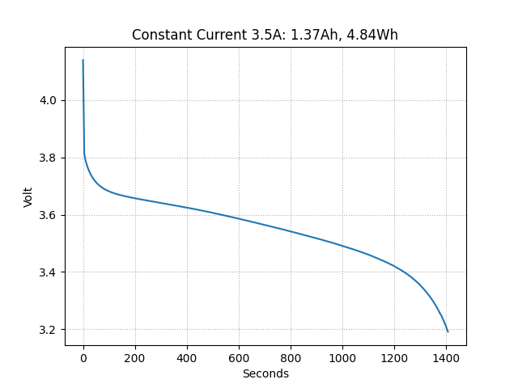

# KEL100 Series Electronic Load Tool and Battery Tester



This is a tool for operating and battery testing with KEL100 series electronic loads. These come in several brands and configurations, included but not limited to:

- Korad KEL102 (150W)
- Korad KEL103 (300W)
- RND 320-KEL102 (150W)
- RND 320-KEL103 (300W)
- RS PRO RS-KEL102 (150W)
- RS PRO RS-KEL103 (300W)

The software for these units looks to be made by Fisher Price, but luckily there is [documentation](serial-protocol.pdf) available for interfacing to the unit over USB serial and IP. This project uses USB serial, but the contents of the protocol is (as I understand it) the same, so modifying it to interface over IP should be trivial. My main interest in this unit is battery capacity testing, so this is the primary motivation for writing this tool. But it does also offer control over most other aspects of the load, such as changing mode (constant voltage, constant current, constant power or constant resistance), activating and deactivating the input as well as measurement of voltage, current and power.

## Installation

Download the zip-file and unzip or check out with git. Open a shell or command prompt and change directory to the downloaded project folder:

```shell
cd path/to/project
```

### Initialise a virtual environment:

```shell
python -m venv .venv
```

### Activate the virtual environment:

#### PowerShell

```shell
.venv/Activate.ps1
```

#### BASH

```shell
source .venv/activate
```

#### Windows

```shell
.venv/activate.bat
```

### Install requirement in the virtual environment

```shell
pip install -r requirements.txt
```

## Usage

### Options valid for any command

- `--serial-port <SERIAL-PORT>`
    - Defaults to the contents of environment variable SERIAL_PORT
- `--serial-speed <SERIAL-SPEED>`
    - Defaults to environment variable SERIAL_SPEED or 115200

### Battery Test

Start a battery test on the load connected to COM3, running at a constant current of 3.5A with cutoff after 5400 seconds or when the voltage drops below 3.2V. Writes result to report.csv and report.png.

```shell
python main.py --serial-port COM3 battery-test \
  --constant-current 3.5                       \
  --cutoff-seconds 5400                        \
  --cutoff-voltage 3.2
```

- `--cutoff-voltage <VOLTAGE>`
    - Stop test and disable load when voltage drops below `<VOLTAGE>`
- `--cutoff-seconds <SECONDS>`
    - Stop test and disable load after `<SECONDS>` seconds
- `--no-cutoff`
    - Do not automatically stop the test (can be dangerous)
- `--constant-current <CURRENT>`
    - Draw a constant current of `<CURRENT>` amps
- `--constant-power <POWER>`
    - Draw a constant power of `<POWER>` watts
- `--sampling-interval <SECONDS>`
    - Read new sample every `<SECONDS>` second (default: 5)
- `--file-base-name <NAME>`
    - Save report in `<NAME>`.csv and `<NAME>`.png (default: report)
- `--verbose`
    - Print measurements to console every `<sampling-interval>` seconds

### Identify Product

```shell
python main.py --serial-port COM3 id
```

```
KORAD-KEL103 V3.10 SN:00013588
```

### Enable Input (start drawing current)

```shell
python main.py --serial-port COM3 enable
```

### Disable Input (stop drawing current)

```shell
python main.py --serial-port COM3 disable
```

### Show Status And Measurements

```shell
python main.py --serial-port COM3 status
```

```
Constant Current: 3.5A (On)
Voltage: 3.9V
Current: 2.497A
  Power: 9,7383W
```

### Setup Constant Voltage Mode for `<VOLTAGE>` volts

```shell
python main.py --serial-port COM3 constant-voltage <VOLTAGE>
```

### Setup Constant Current Mode for `<CURRENT>` amperes

```shell
python main.py --serial-port COM3 constant-current <CURRENT>
```

### Setup Constant Power Mode for `<POWER>` watts

```shell
python main.py --serial-port COM3 constant-power <POWER>
```

### Setup Constant Resistance Mode for `<RESISTANCE>` Ω

```shell
python main.py --serial-port COM3 constant-resistance <RESISTANCE>
```

